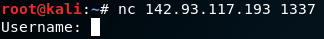

Writeup 2 - OSINT (Open Source Intelligence)
======

Name: *Brianna Higgins*
Section: *0201*

I pledge on my honor that I have not given or received any unauthorized assistance on this assignment or examination.

Digital acknowledgement of honor pledge: *Brianna Higgins*

## Assignment 2 writeup

### Part 1 (45 pts)
1. Real Name: Fred Krueger  

2. Personal Information about Fred Krueger:   
  - Started by searching 'kruegster1990' using Google:
    
  - From Twitter (found through [STWITY](https://stwity.com/umdcsec/following)):
    * Handle: [@kruegster1990](https://twitter.com/@kruegster1990)    
    * [Following UMD Cybersecurity on Twitter](https://stwity.com/umdcsec/following)    
    * Uses Twitter Web Client   
    * Location: Silver Spring, MD   
    * Born: 1990   
    * Website: [cornerstoneairlines.co](cornerstoneairlines.co)   
  * From Website:
    * Owner of Cornerstone Airlines
    * Email: kruegster@tutanota.com
      * Not compromised in a data breach, as confirmed on haveibeenpwned.com
  * From [knowem.com](knowem.com) ([checkusernames.com](checkusernames.com) was not working when I tried it)   
    * Instagram: [@kruegster1990](https://www.instagram.com/kruegster1990/)   
      * Has a ticket for flight AAC27670 from BWI to SFO on 12.09.2018
        
      * Possibly interested in Pokemon, since all the other pictures are of Pokemon
    * Reddit: [u/kruegster1990]( https://www.reddit.com/user/kruegster1990)       

3. IP Address of Webserver Hosting His Company's Site: __142.93.118.186__
 * Found by searching the domain name 'cornerstoneairlines.co' on MXTOOLBOX:
     

4.  Hidden Files or Directories   
  * Flag: __CMSC389R-{fly_th3_sk1es_w1th_u5}__   
      1. Visited http://cornerstoneairlines.co/robots.txt   
      2. Found "Disallow: /secret"
      3. Visited http://cornerstoneairlines.co/secret (which contains a blank page)
      4. Checked the source code and found the flag.   

  * Flag: __CMSC389R-{y0u_found_th3_g1t_repo}__   
      1. Ran 'dirb http://cornerstoneairlines.co'
      2. Found http://cornerstoneairlines.co/.git/HEAD      
      
      3. Flag found in folder COMMIT_EDITMSG   

5. Other IP Addresses Associated with Website:
  * IP Address: 142.93.117.193   
      * Found it by clicking Admin on http://cornerstoneairlines.co

6.  Location of Associated Server(s)
  * 142.93.117.193 located in New York City, New York   
  

7.  Operating System Running on Associated Server(s)
  * 142.93.117.193: Ubuntu   
      * Found by searching the IP on censys.io:
        

8.  BONUS:
    1. CMSC389R-{h1dden_fl4g_in_s0urce}
      * In source code of http://cornerstoneairlines.co/index.html
    2. CMSC389R-{dns-txt-rec0rd-ftw}   
      * In TXT records when searching 'cornerstoneairlines.co' on https://dnsdumpster.com/

### Part 2 (55 pts)

1. Determine what ports are open on the server using an exhaustive nmap scan: nmap 142.93.117.193 -p-  

     
2. Attempted to connect to server using: nc 142.93.117.193 <port\>   
  * Found that port 1337 printed "username:"   
     

3. Edited [stub.py](code/stub.py) and tried to bruteforce the password:
 * Tried with username: "kruegster1990", with no luck.
  * Tried using kruegster and was meet with Success!
  * The script outputed the password: "pokemon", which makes sense given that the instagram page was full of pokemon pictures and the twitter page had a link to a Pokemon Go! article.

4. In the system, I checked usual places that users store data, specifically the home directory.   
  * In the home directory, I found a flight_records folder containing text files labels with flight numbers.   
    

  * Using the information from the ticket found on the Instagram page, I opened the file named "AAC27670.txt"
 

__Additional Searching on the Admin Server:__   

 I was curious what was contained in the other text files in the flight_records folder, so I checked the files "AAC27671.txt" and "AAC27669.txt".  I found that they contained the same string, with the numbers at the end being associated with the flight number.   

   

To see what was contained in the other textfiles, I wrote another script [flightrecordscollection.py](code/flightrecordscollection.py) and ran it to output all the flags in to another text file.  The [result](code/flightrecordsflags.txt) was that all the files contained flags, following this same pattern.
