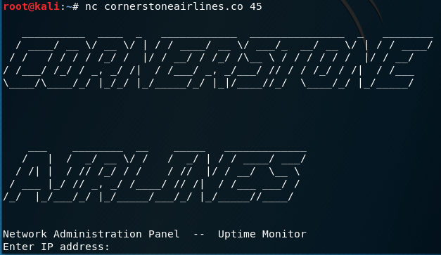
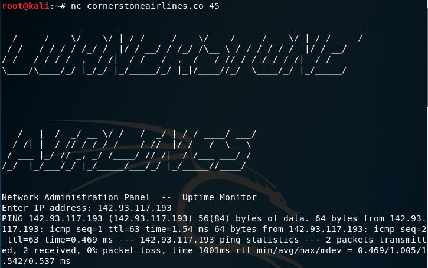
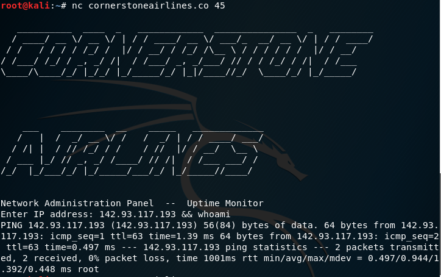
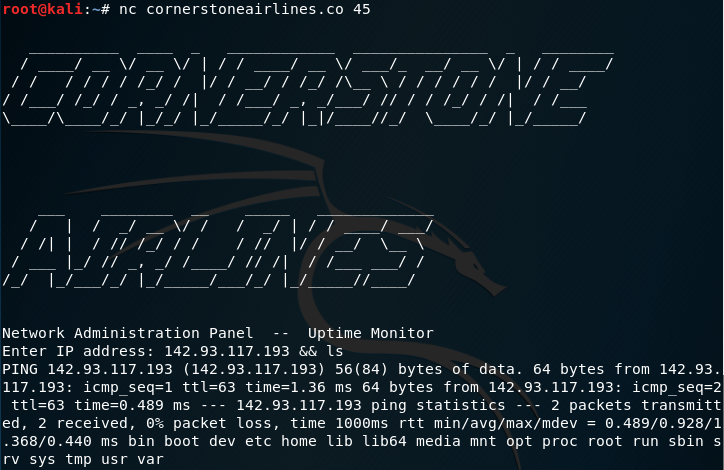
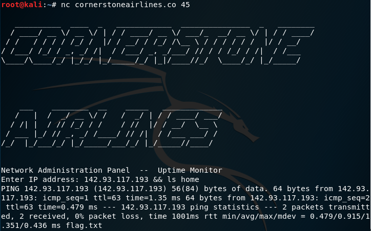
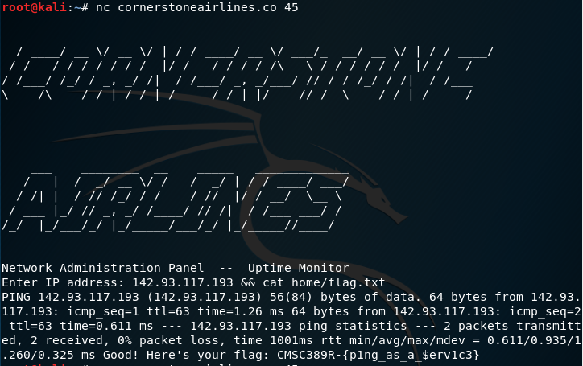
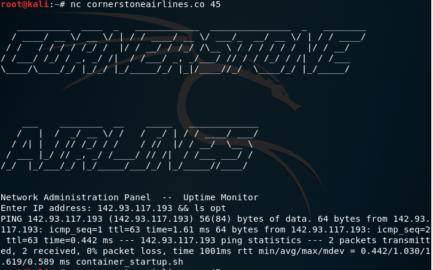
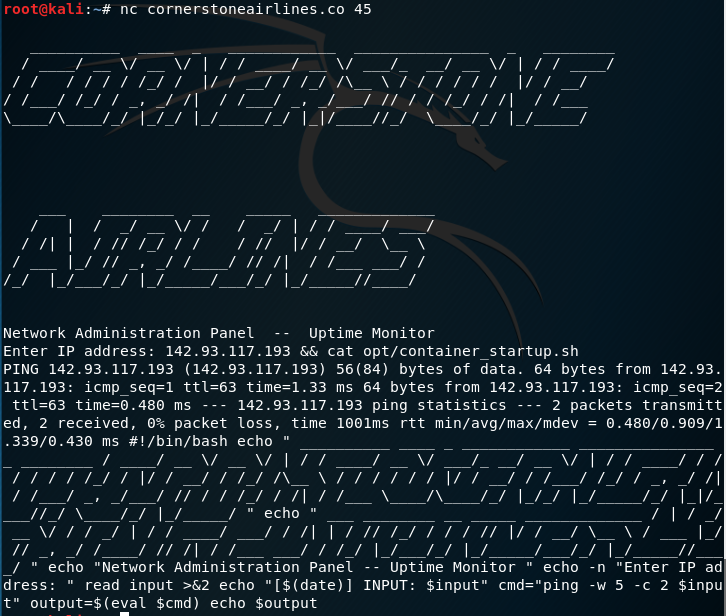

Writeup 3 - Pentesting I
======

Name: *Brianna Higgins*
Section: *0201*

I pledge on my honor that I have not given or received any unauthorized assistance on this assignment or examination.

Digital acknowledgement of honor pledge: *Brianna Higgins*

## Assignment 4 Writeup

### Part 1 (45 pts)

A vulnerability analysis of the new uptime system for Cornerstone Airlines was conducted during the timeframe of 21 September 2018 -
27 September 2018.  The below process provides a proof of concept (POC) that the new uptime system is not as secure as the owner, Fred Krueger, claims it to be.

1. The provided command `nc cornerstoneairlines.co 45` was executed to provide a basic understanding of what the new system.  Upon execution of the command the following screen was displayed:

  

2. During a previous security evaluation exercise, the IP address `142.93.117.193` was identified as the address CornerstoneAirlines's administrator server.  Upon entering the IP address, the following information was display:

  

3.  With a basis of how the uptime system works, Open Source research was conducted using the information that it utilizes the Linux ping command and it could possibly be vulnerable to a Command Injection attack.  From the HackerOne blog post 'How to: Command Injections' [<sup>1</sup>](https://www.hackerone.com/blog/how-to-command-injections), it was determined that adding a '&&' at the end of the command will allow for additional commands to be executed after and the results to printed after the original output.

4. The above technique was tested on the server and provided the expected results and the following commands were executed on the server:
  * Using `whoami`, it was determined the current user is root

       
  *  Using `ls`, the files contained in the current directory were displayed

       

  * Using `ls home`, the home directory was checked and a text file titled `flag.txt` was found

       

  * Using `cat home/flag.txt`, the contents of the text file titled `flag.txt` was outputted

    

In order to provide some suggested precautions, the script being used to check the uptime was found and evaluated.

1. It was determined that the script was being executed at run time, so Open Source research was conducted to find the standard location in the Linux file structure storing for custom Scripts.  It was determined that these scripts can be found in the `opt` folder[<sup>2<sup>](https://askubuntu.com/questions/195652/is-there-a-standard-place-for-placing-custom-linux-scripts), since
> "According to the Filesystem Hierarchy Standard, /opt is for "the installation of add-on application software packages". [<sup>3</sup>](https://unix.stackexchange.com/questions/11544/what-is-the-difference-between-opt-and-usr-local)

2. Upon checking the `opt` directory, a shell script titled `container_startup.sh` was found:

  

3. Using 'cat opt/container_startup.sh', the contents of the shell script were retrieved how the uptime is currently being checked

  
  ```
  read input >&2
  echo "[$(date)] INPUT: $input"
  cmd="ping -w 5 -c 2 $input"
  output=$(eval $cmd)
  echo $output
  ```

To prevent exploitation of this vulnerability, it is recommended to sanitize the input value to check for malicious data or only allow a predetermined parameter.  In this case, a regular expression could be used to only accept only IP addresses and prevent other input from being executed.  The input could also be executed in a test file before to test the output before printing the result to the user.   

### Part 2 (55 pts)

The act of exploiting the above vulnerability can be tedious, so in order to provide more convenience to the attacker an interactive shell, [stub.py](code/stub.py), was developed.  This script allows for the user to interact with the system without having to constantly run the `nc cornerstoneairlines.co 45` and appending the desired command.  It gives the illusion that the user is actively present within the file system, when in reality each command is being run separately utilizing the ability to inject commands into the Uptime Monitor.

The script is written using Python 3 and can be executed using `python stub.py` on any computer with an installed version of Python 3.

The script has the following commands that the user can execute upon startup:
1) `shell`: Drop into shell and gracefully exit   
2) `pull <remote-path> <local-path>``: Download files   
3) `help`: Shows this help menu   
4) `quit`: Quit the shell

Before the `shell` command has been requested, users will only be able to execute the above commands.  Any other commands will result in the message `Invalid Command.  For Valid Commands, Type help.` is output and the prompt is displayed again for them to provide other input.

Once the `shell` command has been requested, users will be presented with an interactive shell that provides the illusion that they are navigating through the CornerstoneAirlines server file system.  Commands allowed on the server will be executed accordingly.
